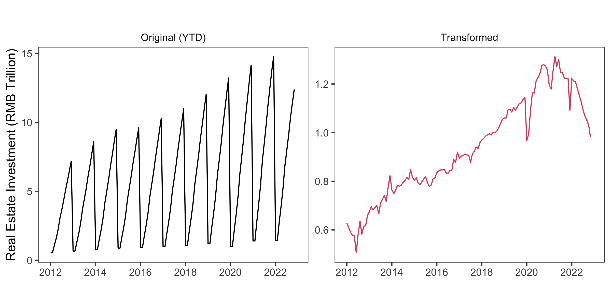

# csutil

## Overview

Statistics with Chinese characteristics make it particularly difficult to do
time series analysis. This package includes utility functions that are useful
for analyzing time series data in general, with a particular focus on addressing
the challenges that arise when working with Chinese macroeconomic data.

## Demo Usage

Most of the time series released by the National Bureau of Statistics (NBS) of
China are not seasonally adjusted, therefore consecutive observations are not
directly comparable. The Lunar New Year effect further complicates the problem.
As the Lunar New Year holiday falls arbitrarily between January and Feburary
every year, it completely distorts the seasonal patterns of the first two months
in a solar calendar, which renders standard seasonal adjustment methods
inadequate to address the issue. To smooth over unpredictable seasonal
fluctuations, NBS prefers to release data in year-to-date (YTD) levels or
year-over-year (YoY) growth rates. None of them are suitable for time series
analysis. 

The package provides a one-stop function to split the YTD series, take care of
the Lunar New Year effect, and seasonally adjust the data. 

```r
REInv |> csutil::trans(YTD = "split", seas = "x11a") 
```



## Disclaimer

This package does not come with any warranties or guarantees of any kind, either
express or implied. The authors of the package do not guarantee the quality,
accuracy, completeness, or reliability of the functions. This package is
intended for personal study purposes only and should not be used for any other
purpose. The user is solely responsible for any risk associated with the use of
this package.
